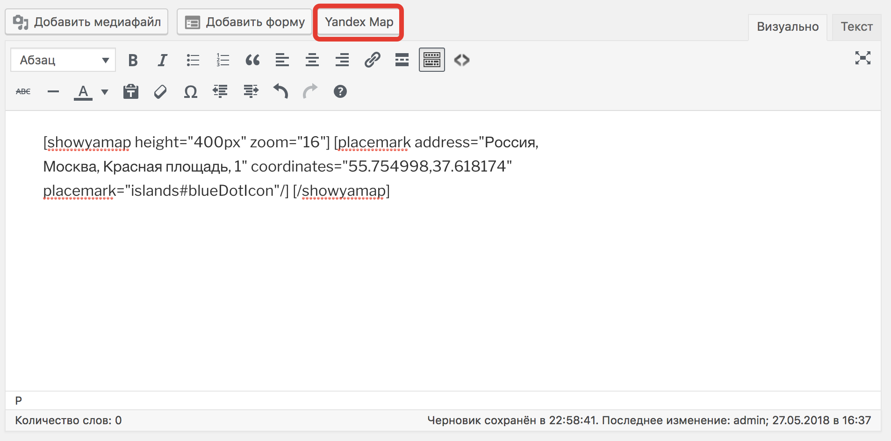
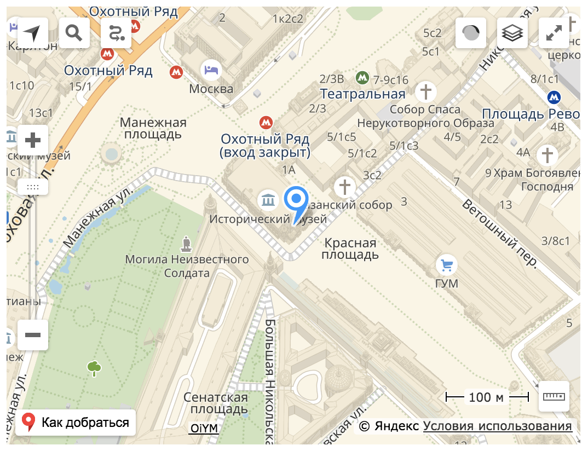
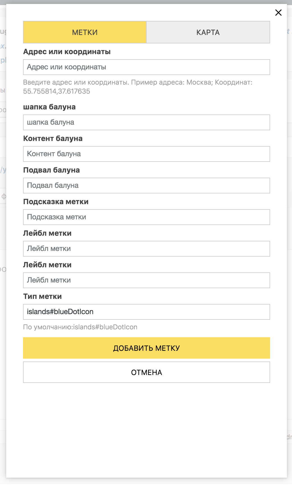
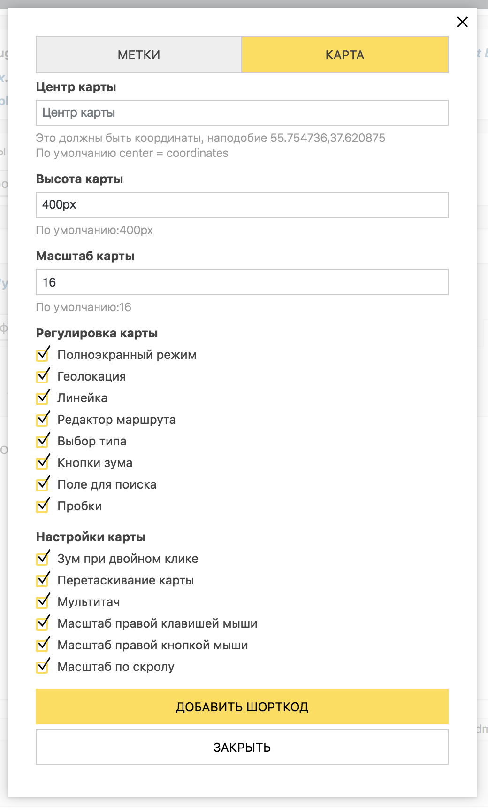

# Oi Yandex.Maps for WordPress
Oi Yandex.Maps for WordPress is most popular free Yandex maps plugin. It allows you to easily add a Yandex map to any WordPress post, page or custom post type by simply typing the address. You even able to put so many placemarks as you wish.

## Description

This plugin uses <a target="_blank" href="http://maps.yandex.com/">Yandex.Map</a> API service to provide maps on your site.
You can point coordinates or address of some places, and put your map to any page of your site.
You can add so many maps on one page and so many placemarks on a map as you want.
Just use shortcode with parameters. You can use custom fields - 'latitude' and 'longitude'.
Now you can use visual shortcode editor.

API loads not on every page, but only when it's needed! 

## Installation

1. Upload `oi-yamaps` folder to the `/wp-content/plugins/` directory.
2. Activate the plugin through the 'Plugins' menu in WordPress.

## Frequently Asked Questions

### I have problems with activation

If you see something like this 'Plugin has not correct header', just reactivate the plugin. This issue comes because of renaming file to correct naming.

### How can I add Stretchy Icons?

Just add the "iconcontent" attribute [showyamap address="Moscow, Birulevskaya st., 1" iconcontent="Content"]

### How can I change Stretchy Icon color?

Use simple islands icons "islands#nightIcon" or islands icons with dot "islands#nightDotIcon". If you use "iconcontent" then icon automaticaly turns to stretchy.

### Russian description
https://oiplug.com/plugins/oi-yandex-maps-for-wordpress

## Screenshots
 
1. Shortcode in admin panel: 

2. Map on a front page: 
 
3. Placemark form: 
 
4. Map form: 

## Changelog

###  3.1.1 (29.05.2018) 
* new: design;
* refactoring;
###  2.50 (18.03.2016) 
* new: address coordinates caching added;
* fix: refactoring coordinates getting function;
* fix: only one field left for address or coordinates;
###  2.42 (21.10.2015) 
* fix: coordinates print deleted;
###  2.41 (21.10.2015) 
* fix: map center normalized;
###  2.4 (21.10.2015) 
* fix notices;
* form view;
* shortcode making;
* plugin url;
###  2.3 (08.12.2014) 
* fix: showmap coordinates missing;
* fix: fixed error when showmap doesn't contain coordinates;
* new: now you can turn off map controls
* new: added custom placemark image
* new: map center depends on placemarks
###  2.2 (16.09.2014) 
* fix: fixed error when coordinates used
* fix: fixed error whith map center
* new: added shortcode button
* new: localization: russian language added
###  2.1 (22.07.2014) 
* fix: fix html in placemark
* new: center parametr added
* new: curl enable check
###  2.0 (21.07.2014) 
* fix: Some fixes.
* new: Option page added.
* new: Language support added.
* new: Multi Placemarks support added.
###  1.2 (20.05.2014) 
* fix: Placemark ID numbers fixed
* new: iconcontent attribute added - Stretchy Icons support
###  1.1 (02.05.2014) 
* fix: Maps ID numbers fixed
###  1.0 (25.04.2014) 
* Initial release

## Upgrade Notice

### 1.2
None critical update. It just add Stretchy Icons support.

Contributors: sh14

Donate link: https://money.yandex.ru/topup/card/carddetails.xml?receiver=41001112308777&skr_sum=350

## Tags
coordinates, maps, geolocation, location, placemark, yandex

Requires at least: 3.2

Tested up to: 4.8.1

Stable tag: 3.0

## License
This project is licensed under the <a href="http://www.gnu.org/licenses/gpl-2.0.html">GPLv2 or later</a> License - see the LICENSE.md file for details

